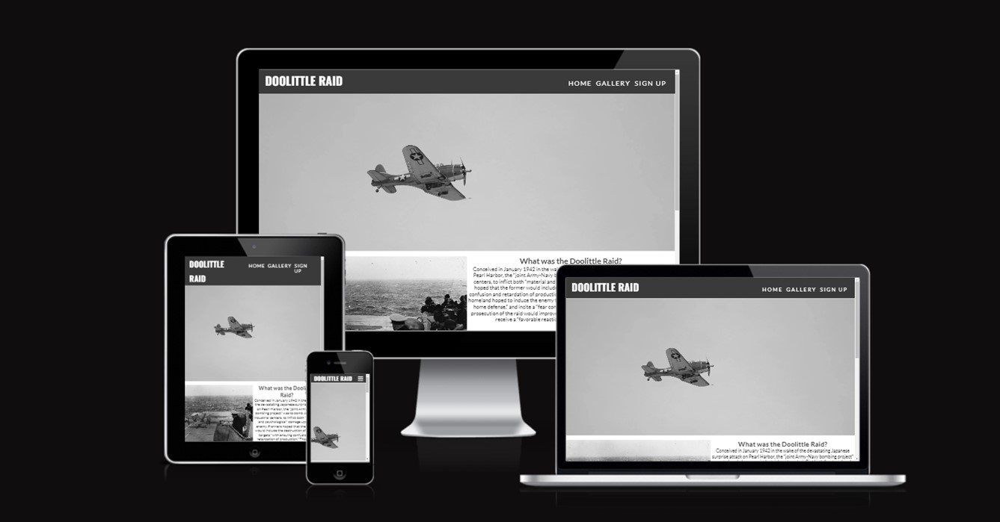
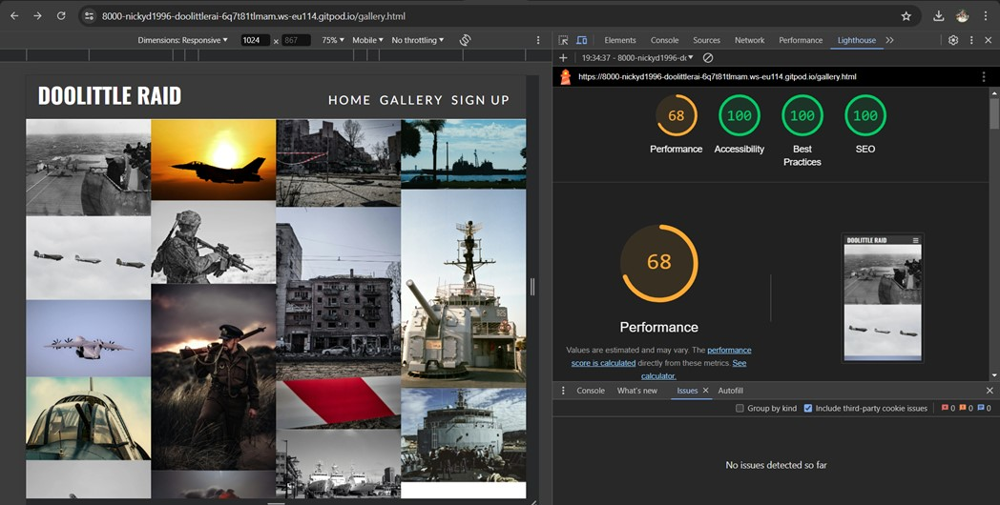
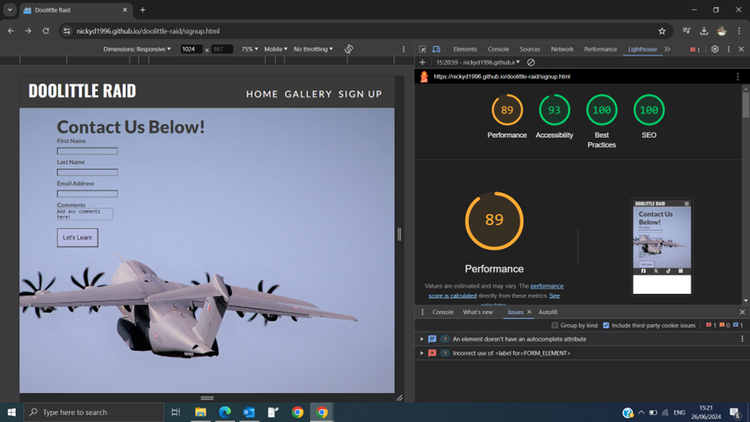

# Doolittle Raid

Doolittle Raid company is looking for people wanting to go on tours to learn more about the history of the event. Anyone can sign up for the tours by filling in the form on the sign up page and they have the choice to leave a comment if they would like to in the textarea box. 

In the footer section there are links to social media. 

[View Doolittle live project here](https://nickyd1996.github.io/doolittle-raid/)

## Table of Contents

### [User Experience (UX)](#user-experience-ux-1)
* [User Stories](#user-stories)
### [Design](#design-1)
### [Features](#features-1)
* [Existing Features](#existing-features)
### [Features Left to Implement](#features-left-to-implement-1)
### [Technologies Used](#technologies-used-1)
### [Frameworks, Libraries & Programs Used](#frameworkes-libraries-and-programs-used)
### [Testing](#testing-1)
## [Validation Results](#validation-results-1)
* [Manual Testing](#manual-testing)
* [Lighthouse Report](#lighthouse-report)
### [Deployment and local development](#deployment-and-local-development-1)
* [GitHub Pages](#github-pages)
* [Forking the GitHub Repository](#forking-the-github-repository)
* [Local Clone](#local-clone)
### [Credits](#credits-1)
### [Acknowledgements](#acknowledgements-1)
---

## User Experience (UX)

This website is created to attract people who would like to learn more about the doolittle raid and who would like to go on tours. 

There is a clear navigation to take the user to any page they would like. 

They can use the sign-up page to get in contact with the company itself as well as sign up for a tour. 

## User Stories

  * First-Time visitor goals
    * Understand the purpose of the site and learn about the Doolittle Raid
    * Easily navigate throughout the site.
    * Find the sign-up form and fill in their details. 
  * Returning visitor goals
    * Find out about the tour times.
    * Locate the sign-up page and submit their information.
    * Enjoy the site's gallery.
  * Frequent user goals
    * Check tour times. 
    * Review the gallery for new images. 
- - -

## Design
  * Color Scheme
    * Primary colors used on the website 

  * Typography
    * Lato and Oswald were used throughout the site with the sans-serif font as the backup.
  
  * Wireframes
    * Pen and Paper : kept it simple. 
- - - 

### Features

 * This website is for anyone interested in the Doolittle Raid. 
 * They can navigate all the pages and sign-up for a tour by filling out a form.
 * Reponsive on all device sizes. 

## Existing Features
  * Navigation bar 
    * Featured anf fixed on all pages. 
    * Includes links to the logo, home page, sign-up and gallery pages. 
    * Identical in design across all pages. 
    * Allows for easy access to all pages on the website. 

  * Hero Image 
    * It is composed of an image of a bomber plane flying through the sky in a grayscale. 
    * It is only on the home page and it is used to capture the attention of the users of the website.

 

  * Section One, What was it?
    * This gives a brief introduction of what the Doolittle Raid was about. 
    * This section has two divs, one with an image and the other with the heading and description. 

  * Section Two, What is the significance of the Doolittle Raid?
    * This section goes through what the outcomes of this raid were about. 
    * This section has two divs, one with an image and the other with the heading and description. 

  * Section 3, Tours section
    * This section gives the users information about the tours opening hours, where the meeting point is and how long a usual tour takes. 

  * Footer 
    * Links to social media will open in a new tab when clicked to allow for easy navigation. 

  * Gallery
    * The gallery will provide users with supporting images of the tours and the options available. 

  * Sign-Up
    * This page allows users to fill in their details to sign up for a tour. 
    * In the future, there will be packages that can be chosen from. 
    * The users can also add any comments they would like using a textarea input. 

  * Thank you Page
    * To let the user know that their form has been submitted. 

## Features Left to Implement

  * Choosing a time slot on the form page.
  * Update the gallery with more images.
  * In the future, there could be an online platform to learn about the doolittle raid without having to go on one of the tours.

- - -

## Technologies Used
  * [html5](https://en.wikipedia.org/wiki/HTML5)
  * [css3](https://en.wikipedia.org/wiki/CSS)

- - -

## Frameworkes, Libraries and Programs Used
 * [Gitpod](https://www.gitpod.io/)
    * To write the code.
 * [Git](https://git-scm.com/)
    * for vesion control.
 * [Github](https://github.com/)
    * Deployment of the website and storing the files online.
 * [Google Fonts](https://fonts.google.com/)
    * Imported fonts to the website.
 * [Am I Responsive](https://ui.dev/amiresponsive)
   * Mockup picture for the README file.
- - -

## Testing

The W3C Markup Validator and W3C CSS Validator services were used to validate every page of the project to ensure there were no errors.

 * [W3C Markup Validtor](https://validator.w3.org/)
 * [W3C CSS Validator](https://jigsaw.w3.org/css-validator/)

 ## Validation results

 

index.html

gallery.html

sign-up.html

form-received.htmml

style.css

- - - 

### Manual Testing

* The website was tested on Google Chrome, Microsoft Edge, and Safari.
* The website was viewed on a desktop computer, laptop, and Iphone 12 Pro.
* A large amount of testing was done to ensure links between pages are working correctly on all pages.
* Family and friends were asked to review the website for a better understanding of the user experience.
* Dev Tools was used to test how the site looks on various screen sizes.

### Lighthouse Report

#### Desktop analysis

Home Page

Gallery

Sign Up

Thank You Page

## Deployment and local development

## GitHub Pages

GitHub Pages used to deploy live version of the website.
1. Log in to GitHub and locate [GitHub Repository Doolittle Raid](https://github.com/nickyd1996/doolittle-raid)
2. At the top of the Repository(not the main navigation) locate "Settings" button on the menu.
3. Scroll down the Settings page until you locate "GitHub Pages".
4. Under "Source", click the dropdown menu "None" and select "Main" and click "Save".
5. The page will automatically refresh.
6. Scroll back to locate the now-published site [link]() in the "GitHub Pages" section.

### Forking the GitHub Repository

By forking the repository, we make a copy of the original repository on our GitHub account to view and change without affecting the original repository by using these steps:

1. Log in to GitHub and locate [GitHub Repository Doolittle Raid](https://github.com/nickyd1996/doolittle-raid)
2. At the top of the Repository(under the main navigation) locate "Fork" button.
3. Now you should have a copy of the original repository in your GitHub account.

### Local Clone

1. Log in to GitHub and locate [GitHub Repository Doolittle Raid](https://github.com/nickyd1996/doolittle-raid)
2. Under the repository name click "Clone or download"
3. Click on the code button, select clone with HTTPS, SSH or GitHub CLI and copy the link shown.
4. Open Git Bash
5. Change the current working directory to the location where you want the cloned directory to be made.
6. Type `git clone` and then paste The URL copied in the step 3.
7. Press Enter and your local clone will be created.

---

## Credits

### Code
 * Understanding the concept of flexbox was learned through [Complete Guide to Flexbox](https://css-tricks.com/snippets/css/a-guide-to-flexbox/)
 * The README template was helpfully provided by [Code Institute (template)](https://github.com/Code-Institute-Solutions/SampleREADME)

### Content

 * All content was written by the developer using experience from what they have learnt in the first module.
 * [Color contrast checker](https://coolors.co/contrast-checker/112a46-acc8e5) was used to decide which colors would be used for the website.
 * Brittanica was used for information.

### Media 

 * [Pexels](https://www.pexels.com/) free stock photos, royalty free images.
 * [Pixabay](https://pixabay.com/) free stock photos, royalty free images.
 * [Convertio](https://convertio.co/jpg-webp/) Converting Images.
---

## Acknowledgements

 * My mentor Mitko Bachvarov provided helpful feedback and a link to the Flexbox guide.
 * Slack community for encouragement and information.